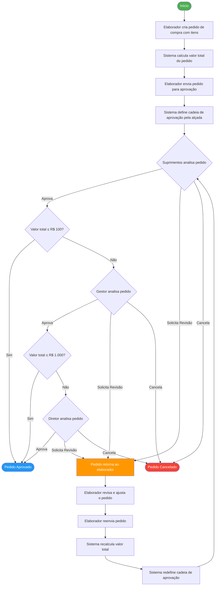

# Diagrama de Atividades — Processo de Pedido de Compras

## Descrição do Fluxo

1. **Criação**: O elaborador cria o pedido com pelo menos 1 item (RN1)
2. **Cálculo**: O sistema calcula o valor total (quantidade × preço unitário) (RN2)
3. **Envio**: O elaborador envia o pedido para aprovação
4. **Definição da Alçada**: Com base no valor total, define-se a cadeia de aprovação (RN3):
   - Até R$ 100: apenas Suprimentos
   - De R$ 101 a R$ 1.000: Suprimentos + Gestor
   - Acima de R$ 1.000: Suprimentos + Gestor + Diretor
5. **Aprovação Sequencial**: Cada nível aprova, solicita revisão ou cancela (RN4, RN8)
6. **Revisão**: Se solicitada, o pedido retorna ao elaborador e, após reenvio, reinicia toda a cadeia (RN5)
7. **Aprovação Final**: O pedido é aprovado quando todas as aprovações exigidas são obtidas (RN7)
8. **Histórico**: Todas as ações são registradas com data, hora, usuário e tipo (RN6)
