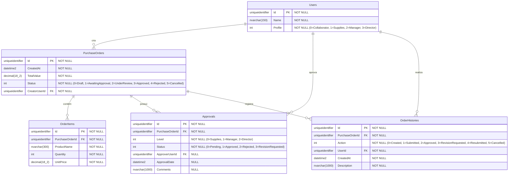

# Diagrama Físico de Banco de Dados — Pedido de Compras

## Detalhes do Modelo Relacional

### Tabela: Users
| Coluna | Tipo | Restrições | Descrição |
|--------|------|-----------|-----------|
| Id | uniqueidentifier | PK, NOT NULL | Identificador único do usuário |
| Name | nvarchar(150) | NOT NULL | Nome do usuário |
| Profile | int | NOT NULL | Perfil do usuário (enum UserProfile) |

### Tabela: PurchaseOrders
| Coluna | Tipo | Restrições | Descrição |
|--------|------|-----------|-----------|
| Id | uniqueidentifier | PK, NOT NULL | Identificador único do pedido |
| CreatedAt | datetime2 | NOT NULL | Data/hora de criação |
| TotalValue | decimal(18,2) | NOT NULL | Valor total calculado (soma dos itens) |
| Status | int | NOT NULL, INDEX | Status do pedido (enum OrderStatus) |
| CreatorUserId | uniqueidentifier | FK, NOT NULL, INDEX | Referência ao usuário criador |

### Tabela: OrderItems
| Coluna | Tipo | Restrições | Descrição |
|--------|------|-----------|-----------|
| Id | uniqueidentifier | PK, NOT NULL | Identificador único do item |
| PurchaseOrderId | uniqueidentifier | FK, NOT NULL, INDEX | Referência ao pedido |
| ProductName | nvarchar(300) | NOT NULL | Nome do produto |
| Quantity | int | NOT NULL | Quantidade |
| UnitPrice | decimal(18,2) | NOT NULL | Preço unitário |

### Tabela: Approvals
| Coluna | Tipo | Restrições | Descrição |
|--------|------|-----------|-----------|
| Id | uniqueidentifier | PK, NOT NULL | Identificador único da aprovação |
| PurchaseOrderId | uniqueidentifier | FK, NOT NULL, INDEX | Referência ao pedido |
| Level | int | NOT NULL | Nível de aprovação (enum ApprovalLevel) |
| Status | int | NOT NULL | Status da aprovação (enum ApprovalStatus) |
| ApproverUserId | uniqueidentifier | FK, NULL | Referência ao usuário aprovador |
| ApprovalDate | datetime2 | NULL | Data/hora da aprovação |
| Comments | nvarchar(1000) | NULL | Comentários do aprovador |

### Tabela: OrderHistories
| Coluna | Tipo | Restrições | Descrição |
|--------|------|-----------|-----------|
| Id | uniqueidentifier | PK, NOT NULL | Identificador único do registro |
| PurchaseOrderId | uniqueidentifier | FK, NOT NULL, INDEX | Referência ao pedido |
| Action | int | NOT NULL, INDEX | Tipo da ação (enum HistoryAction) |
| UserId | uniqueidentifier | FK, NOT NULL | Referência ao usuário que realizou a ação |
| CreatedAt | datetime2 | NOT NULL | Data/hora da ação |
| Description | nvarchar(1000) | NOT NULL | Descrição da ação |

### Índices
- `IX_PurchaseOrders_Status` — consultas por status do pedido
- `IX_PurchaseOrders_CreatorUserId` — consultas por elaborador
- `IX_OrderItems_PurchaseOrderId` — junção com pedido
- `IX_Approvals_PurchaseOrderId` — junção com pedido
- `IX_Approvals_ApproverUserId` — consultas por aprovador
- `IX_OrderHistories_PurchaseOrderId` — junção com pedido
- `IX_OrderHistories_UserId` — consultas por usuário no histórico
- `IX_OrderHistories_Action` — filtros por tipo de ação
- `IX_Users_Name` — consultas por nome
- `IX_Users_Profile` — consultas por perfil

### Relacionamentos
- **Users → PurchaseOrders**: 1:N com RESTRICT DELETE (não pode excluir usuário com pedidos)
- **Users → Approvals**: 1:N com RESTRICT DELETE (opcional — ApproverUserId é nullable)
- **Users → OrderHistories**: 1:N com RESTRICT DELETE
- **PurchaseOrders → OrderItems**: 1:N com CASCADE DELETE
- **PurchaseOrders → Approvals**: 1:N com CASCADE DELETE
- **PurchaseOrders → OrderHistories**: 1:N com CASCADE DELETE
