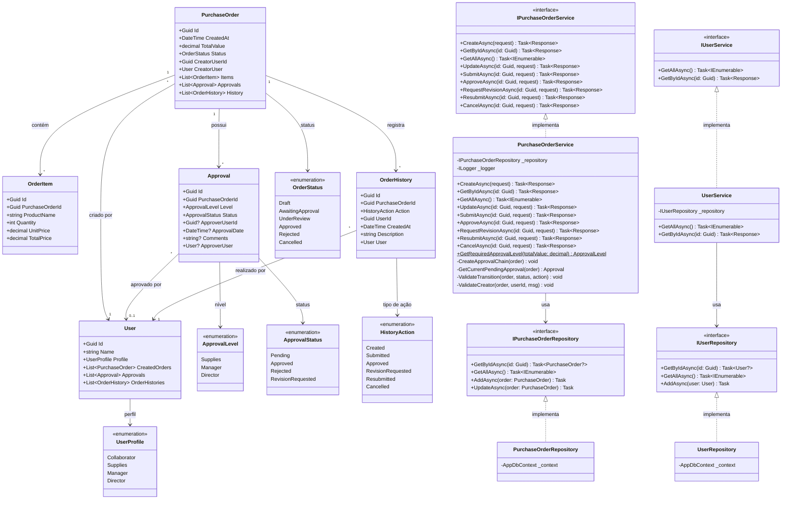

# Diagrama de Classes — Pedido de Compras

## Decisões de Modelagem

- **Anemic Domain Model** — as entidades apenas carregam dados (propriedades públicas, sem métodos de negócio)
- **Toda a lógica de negócio está no `PurchaseOrderService`** — regras de aprovação, transição de status, cadeia de alçadas (RN1 a RN8)
- **Fluxo Controller → Service → Repository** — os controllers nunca acessam repositórios diretamente
- **OrderItem** é uma entidade dependente — só existe no contexto de um pedido
- **Approval** representa cada etapa individual de aprovação com seu próprio status
- **OrderHistory** é imutável após criação — garante rastreabilidade (RN6)
- **User** possui perfil que define sua autoridade no fluxo de aprovação
- **Enums** representam estados finitos e bem definidos do domínio
- **Interfaces** (Repository e Service) garantem desacoplamento e testabilidade
